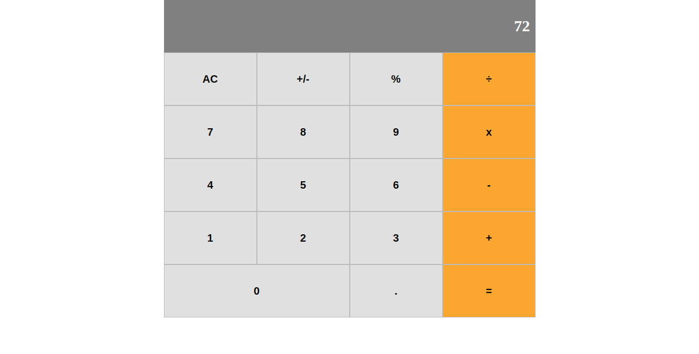

<!--
*** Thanks for checking out this README Template. If you have a suggestion that would
*** make this better, please fork the repo and create a pull request or simply open
*** an issue with the tag "enhancement".
*** Thanks again! Now go create something AMAZING! :D
-->

<!-- PROJECT SHIELDS -->
<!--
*** I'm using markdown "reference style" links for readability.
*** Reference links are enclosed in brackets [ ] instead of parentheses ( ).
*** See the bottom of this document for the declaration of the reference variables
*** for contributors-url, forks-url, etc. This is an optional, concise syntax you may use.
*** https://www.markdownguide.org/basic-syntax/#reference-style-links
-->
Technical Test -- [React-app]
This project is Sezzles's senior software developer technical test!

<!-- TABLE OF CONTENTS -->
## Table of Contents

* [About the Project](#about-the-project)
  * [Built With](#built-with)
* [Contact](#contact)

<!-- ABOUT THE PROJECT -->
## About The Project

This Calculator is created with reactjs
<!-- INSTALLATION -->
## Installation

To have this app on your pc, you need to:
* have to enable javascript on your browser and a code editor
* [download](git@github.com:evabanegacom/New-Calculator.git) or clone this repo:
  - Clone with SSH:
  ```
    git@github.com:evabanegacom/New-Calculator.git
  ```
  - Clone with HTTPS
  ```
    https://github.com/evabanegacom/New-Calculator.git
  ```
* Open the terminal inside the cloned directory:-
```
- run npm start
```


### Built With
This project was built using these technologies.
* Html & css
* Javascript
* react
* Styled-component
* eslint
* VsCode
<!-- CONTACT -->
## Contributors

👤 **Precious**

- GitHub: [@Precious](https://github.com/evabanegacom)
